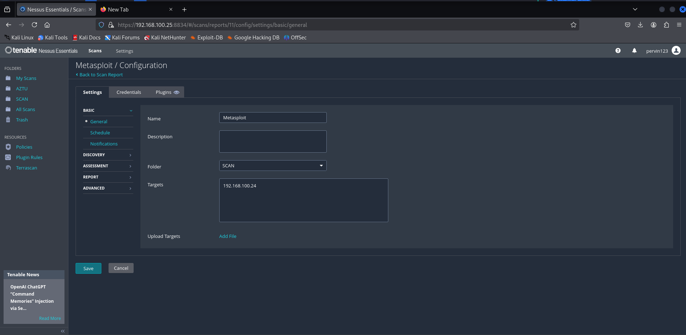
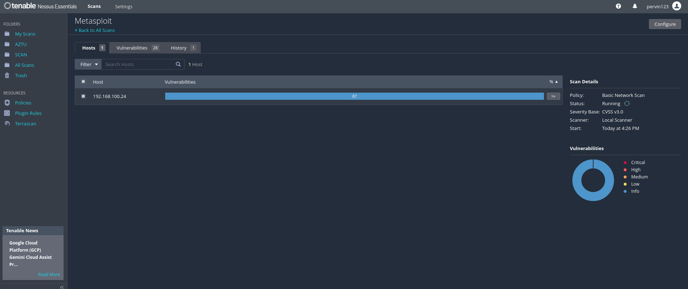
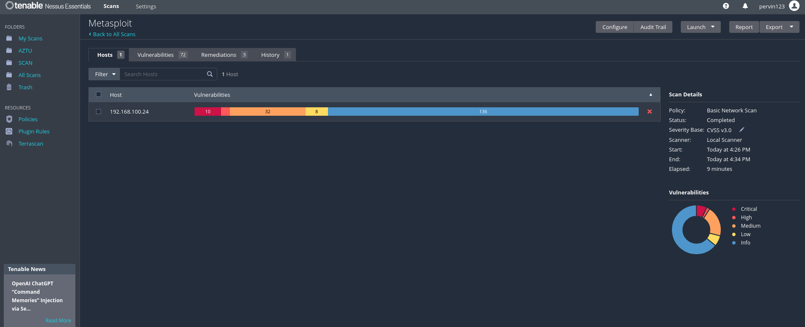
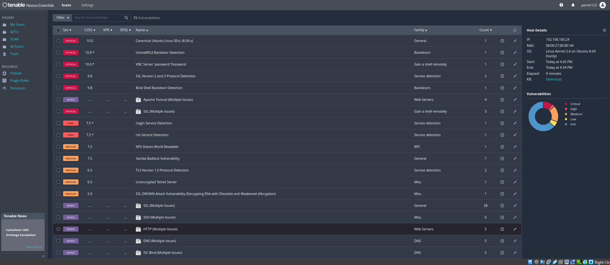
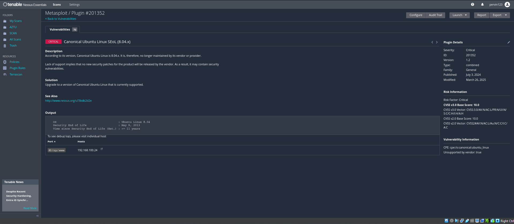
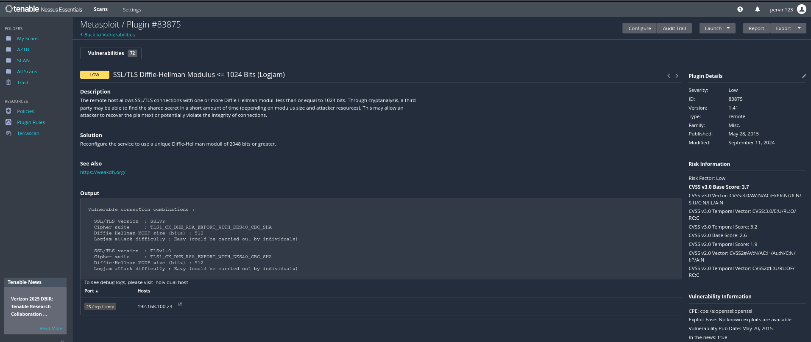
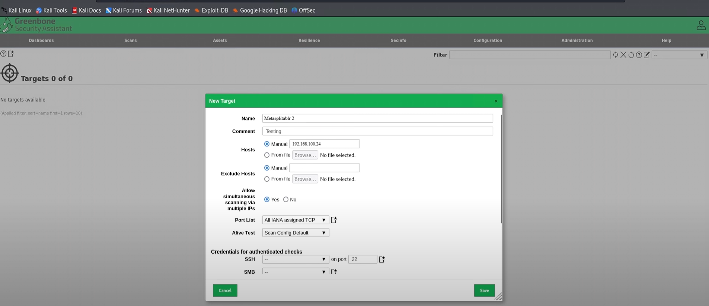
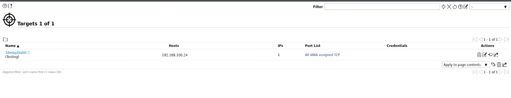
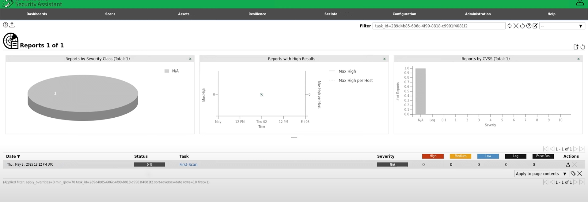

# CyberSecurity-task4

Configuration Nessus

***

start scan 

Information found from the scan

***

scan result

***

critical result

***

Low result 

***

OpenVas config

***

OpenVAs result 
